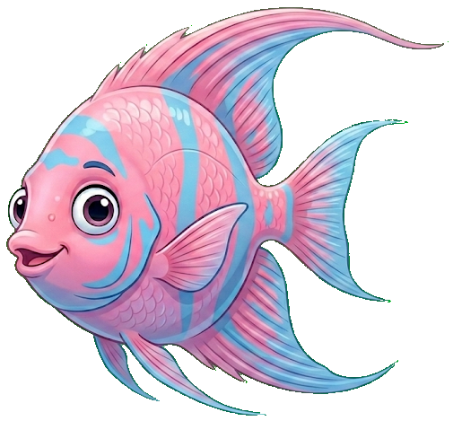

<center>  
  
</center>

<h1 align="center">Dory</h1>

<p align="center">
  <em>Stateless context management for LLM sessions.</em>
</p>

<p align="center">
  
  
  
  
</p>

---

Long, continuous chat threads are the enemy of productivity. They drain your token quota, dilute context, and leave your hard-won project state vulnerable to a single misclick.

**Dory** turns hosted LLM interfaces into disposable, high-performance tools. By offloading state to your local environment and enforcing atomic, single-feature sessions, you keep your costs low and your workflow bulletproof.

---

### 🧠 The Strategy

| Traditional Sessions | Dory Atomic Sessions |
| --- | --- |
| **Bloated:** History re-parsed every turn. | **Lean:** Only active task state loaded. |
| **Vulnerable:** Chat deletion loses everything. | **Persistent:** History saved to local vault. |
| **Expensive:** Context limits hit fast. | **Efficient:** Baseline token usage constant. |

---

### 📂 Repository Structure

Dory integrates directly into your project's version control.

```text
your-project-root/
├── .dory/
│   ├── agents.md             # Operational directives & behavior
│   └── history/              # Local vault for session summaries & code
├── CHANGELOG.md              # Architectural decision ledger

```

---

### ⚙️ Operational Directives (`agents.md`)

Dory relies on three pillars of configuration to maintain speed and precision.

#### **I. Core Behaviors**

* **Intent-First:** The model prioritizes your structural goals over literal text.
* **Zero-Padding:** No fluff, no intros, no conversational wrapping. Just code.
* **Decomposition:** Mandatory `[PLANNING]` ➔ `[IMPLEMENTING]` ➔ `[TESTING]` flow.

#### **II. Tactical Engineering**

* **Minimalism:** Clean, flat code—no defensive boilerplate or redundant abstractions.
* **Terminal Aesthetics:** Uses `ljust` and `flush=True` for clean, real-time feedback.
* **Verification:** Probes the directory (via `ls`, `grep`) before acting. No assumptions.

#### **III. Vault Protocols**

* **Append-Only Ledger:** High-density, single-line decision tracking.
* **Artifact Vaulting:** Sessions conclude with a mandatory `.md` summary and clean code snippets saved locally.
* **Token Gating:** Every response includes a token metric to signal when it’s time to reset the chat.

---

### 🚀 The Workflow Cycle

1. **Initialize:** Open a fresh chat. Load your `CHANGELOG.md` and `.dory/agents.md`.
2. **Probe:** The model inspects your local environment first.
3. **Execute:** The model delivers direct, polished code.
4. **Monitor:** Watch the token metrics; stay within your quota.
5. **Persist & Clear:** Save your summary to the vault, append your decision to the log, and kill the chat thread.

---

*He says nothing. He writes one line. It works.*
