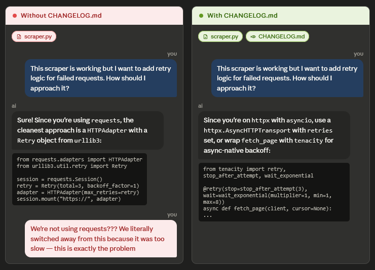

# Dory 🐟


Every new chat starts blind. You burned through a context window, switched models, or just closed a tab and came back tomorrow. Now you're spending the first ten messages re-explaining your project to an AI that has no idea what you built yesterday.

Dory fixes that with one file.



## Get started

Create `CHANGELOG.md` in your repo root:

```markdown
# Project Changelog
<!-- Append-only. One line per entry. No headings or blank lines. -->
```

Start writing. Git tracks it automatically.

```markdown
# Project Changelog
<!-- Append-only. One line per entry. No headings or blank lines. -->

Refactored auth to JWT after session logic started breaking under multi-tenant load
Scaffolded the database schema
Fixed a rendering bug in the tree component
```

Drop the file into context at the start of a session and the model picks up where you left off. To update it, just ask:

> Update the changelog.

For a model switch or a fresh session after a long gap:

> Read the changelog and tell me where we are.

If you're using Claude, copy `SKILL.md` into your project instructions to set the behaviour once for all sessions. See the [`examples/`](examples/) directory for real-world changelogs across different project types.

## Why not just use git history?

Git history tracks code. Dory tracks decisions. A commit message tells you what changed; a changelog entry tells you why you went in that direction and what state you left things in. They work well together.

If your project already has a `CHANGELOG.md` tracking user-facing releases, name this one `AI_CONTEXT.md` or `LLMLOG.md` instead.

## Contributing

This is a convention, not a codebase. If you have a better header, a useful example, or want to add a CLI wrapper, open a PR.

## License

MIT
